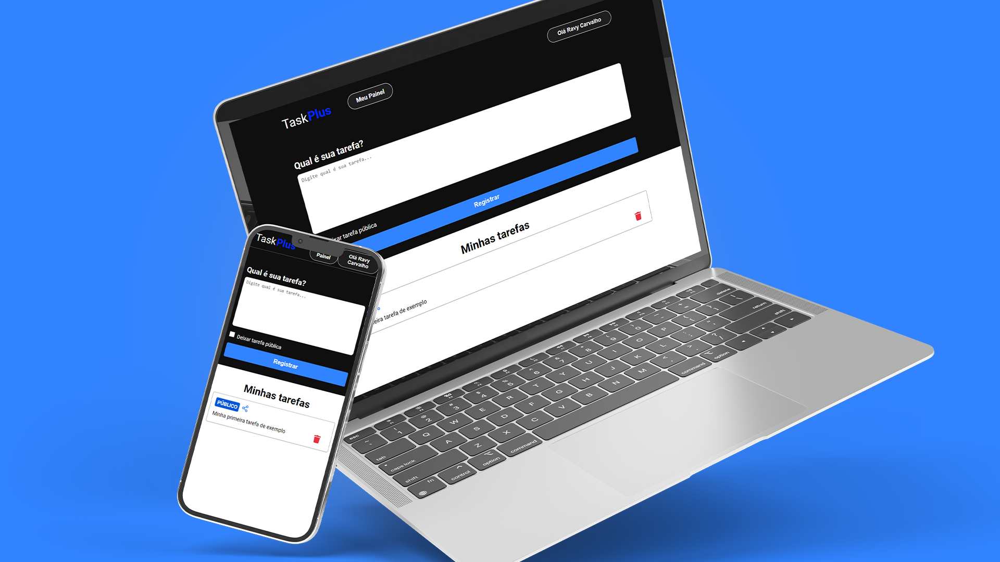

<h1 align="center"> TaskPlus</h1>

  <a href="#-tecnologias">Tecnologias</a>&nbsp;&nbsp;&nbsp;|&nbsp;&nbsp;&nbsp;
  <a href="#-projeto">Projeto</a>&nbsp;&nbsp;&nbsp;|&nbsp;&nbsp;&nbsp;
  <a href="#-layout">Layout</a>&nbsp;&nbsp;&nbsp;|&nbsp;&nbsp;&nbsp;
  <a href="#memo-licença">Licença</a>

  

 

  

## 🚀 Tecnologias

Esse projeto foi desenvolvido com as seguintes tecnologias:

- Next JS
- TypeScript
- Tailwind
- NextAuth + Google Cloud
- Git e Github

## 💻 Projeto

Nosso projeto é uma moderna aplicação de lista de tarefas desenvolvida utilizando tecnologias avançadas para oferecer uma experiência fluida e segura aos usuários. Combinando a robustez do Next.js com a tipagem estática do TypeScript e a estilização eficiente do Tailwind CSS, entregamos uma interface intuitiva e responsiva.

Principais Recursos:

Next.js: Utilizamos Next.js para criar uma aplicação web rápida e otimizada, garantindo renderização do lado do servidor e uma navegação sem interrupções.

TypeScript: Aproveitamos a segurança e produtividade do TypeScript para um desenvolvimento mais confiável, detectando erros em tempo de compilação e melhorando a manutenção do código.

Tailwind CSS: Implementamos o design com Tailwind CSS, permitindo uma personalização detalhada e eficiente sem comprometer o desempenho, graças ao seu uso de classes utilitárias.

NextAuth + Google Cloud: Para autenticação segura e simplificada, integramos NextAuth.js com Google Cloud, oferecendo aos usuários a opção de login com suas contas do Google de forma transparente e confiável.

- [Acesse o projeto finalizado, online](https://task-plus-five.vercel.app/)

## 🔖 Layout

Layout desenvolvido por Ravy Carvalho.

TaskPlus.

